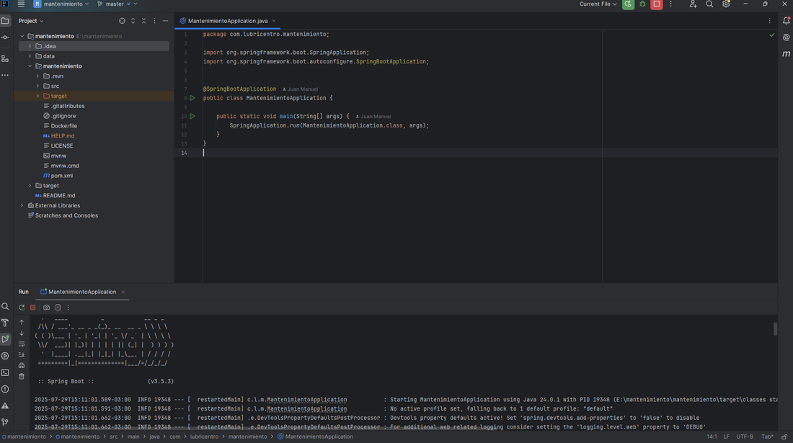
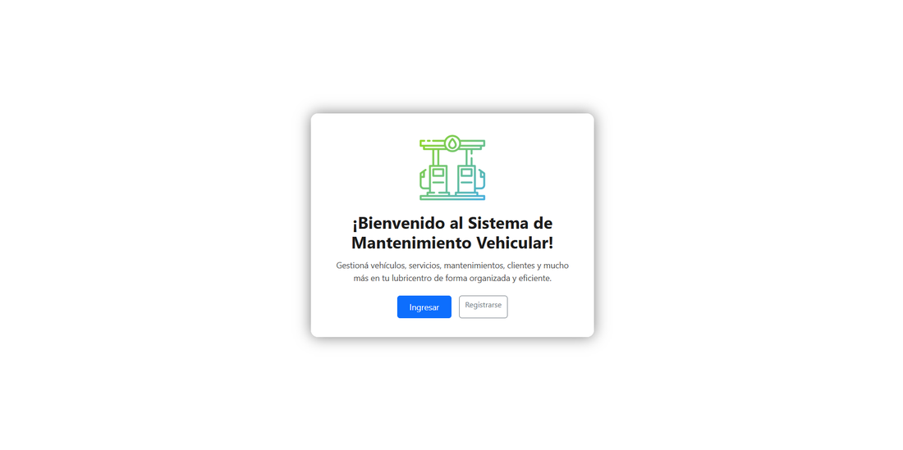
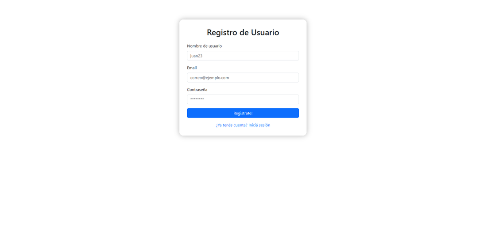
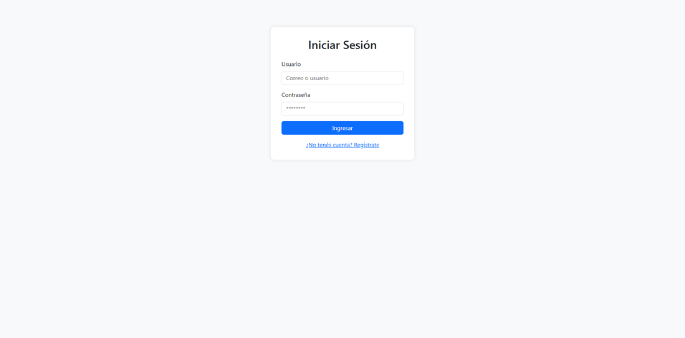
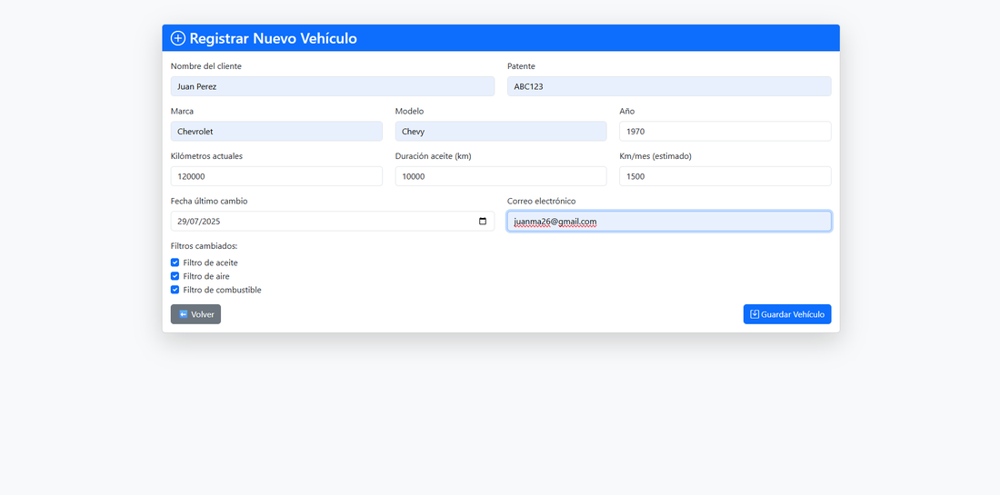
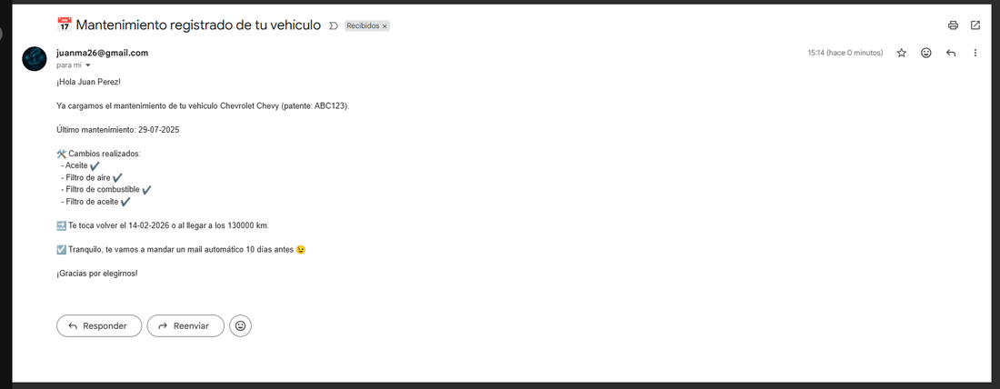
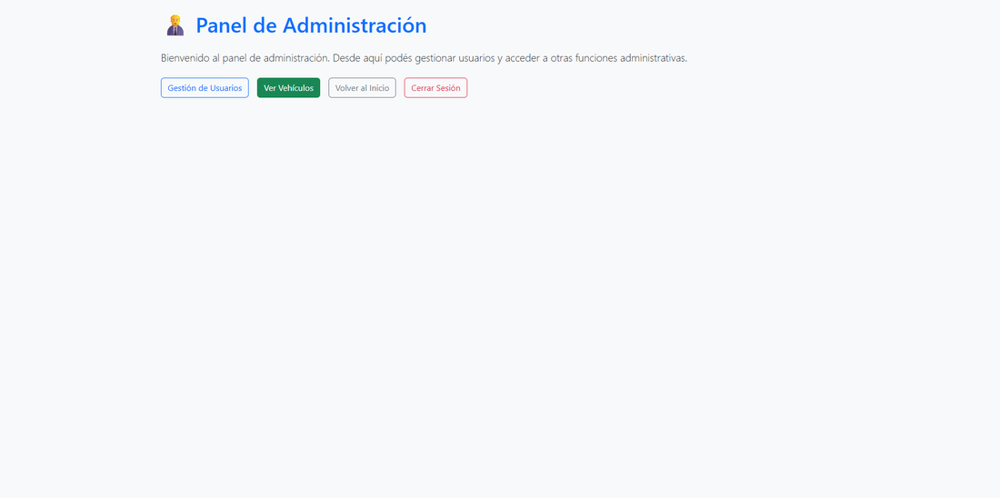
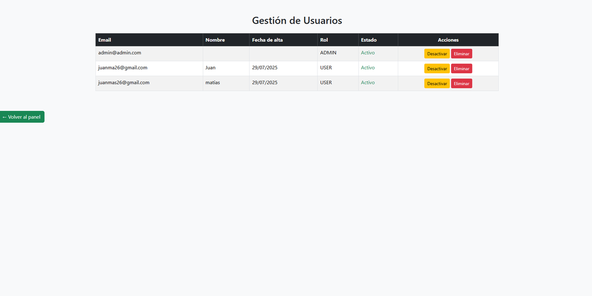

# 🚗 Sistema de Mantenimiento Vehicular

Aplicación web desarrollada con **Java + Spring Boot**, pensada para lubricentros o talleres. Permite gestionar vehículos, mantenimientos, clientes y notificaciones automáticas por correo.

---

## 🧰 Tecnologías utilizadas

- Java 17+
- Spring Boot
- Spring Security
- Thymeleaf
- JPA / Hibernate
- MySQL o H2 (configurable)
- Bootstrap 5
- SMTP para envío de correos

---

## 📸 Capturas de pantalla

### 🛠️ Proyecto en ejecución

<p align="center">
  
</p>

---

### 🏁 Pantalla de Inicio

<p align="center">
  
</p>

---

### 👤 Registro de Usuario

<p align="center">
  
</p>

---

### 🔐 Inicio de Sesión

<p align="center">
  
</p>

---

### ➕ Registrar Nuevo Vehículo

<p align="center">
  
</p>

---

### 📋 Vehículos Registrados

<p align="center">
  
</p>

---

### 📧 Mail Enviado al Cliente

<p align="center">
  
</p>

---

### 🧑‍💼 Panel del Administrador

<p align="center">
  
</p>

---

### 🧾 Gestión de Usuarios

<p align="center">
  
</p>

---

## ⚙️ Cómo ejecutar el proyecto

1. Cloná el repo:

```bash
git clone https://github.com/tu-usuario/tu-repo.git
cd tu-repo


